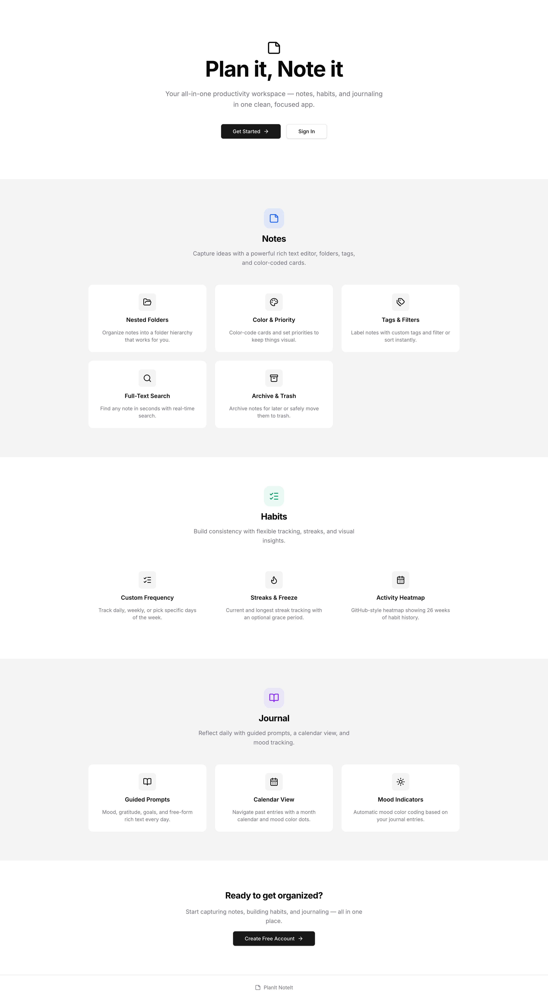
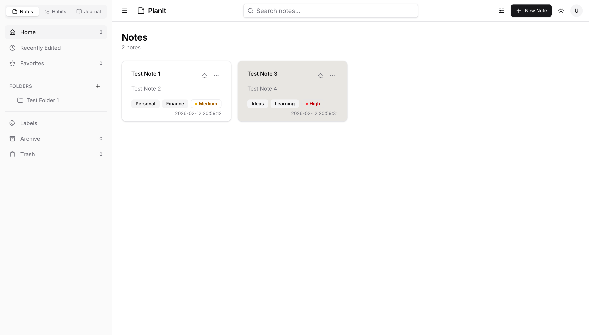
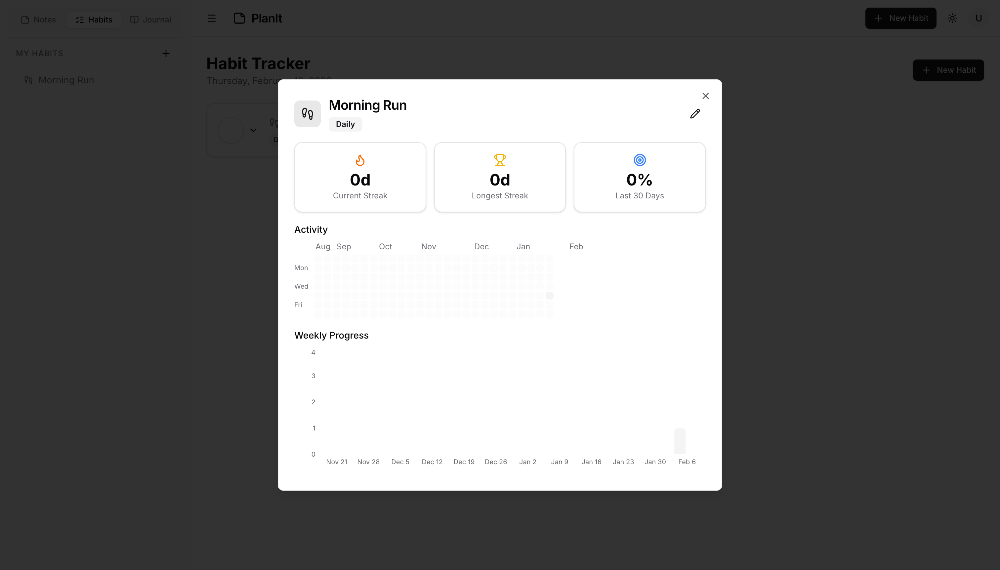
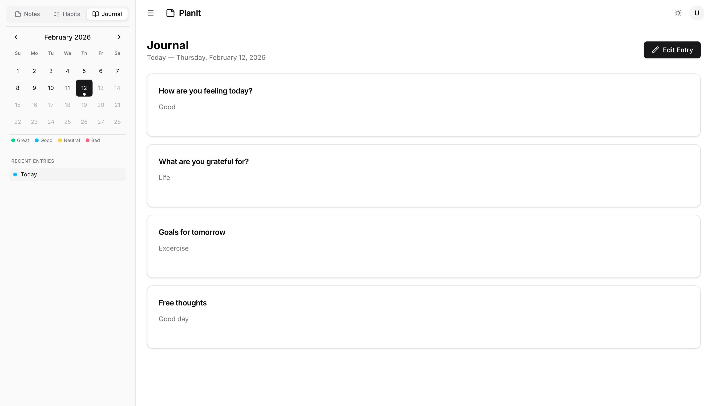

<div id="top"></div>
<div align="center">

   <a href="https://github.com/srishti-maurya/plan-it-note-it/tree/dev">
 
  </a>
   <h3 align="center">PlanIt NoteIt</h3>
  <p align="center">
Your all-in-one productivity app — notes, habits, and journaling in one place.
  </p>
    <br />
    <a href="https://github.com/srishti-maurya/plan-it-note-it/tree/dev"><strong>Explore the code »</strong></a>
    <br />
    <br />
    <a href="https://planit-noteit.netlify.app/">View Demo</a>
    ·
    <a href="https://github.com/srishti-maurya/plan-it-note-it/issues">Report Bug</a>
    ·
    <a href="https://github.com/srishti-maurya/plan-it-note-it/issues">Request Feature</a>
  </p>
</div>

## Preview

### Landing Page


### Notes


### Habit Tracker


### Journal


<p align="right">(<a href="#top">back to top</a>)</p>

## Features

### Notes
- Create, edit, and delete notes with a rich text editor (TipTap)
- Organize notes into nested folders
- Color-coded cards
- Tag and label system with custom tags
- Priority levels with filter and sort (by date, priority)
- Archive and trash with restore support
- Favorite / pin notes
- Full-text search across all notes

### Habit Tracker
- Create habits with custom icons (25+ lucide icons to choose from)
- Flexible frequency: daily, weekly, or custom days of the week
- Set start date, optional reminder time, and streak freeze (1-day grace period)
- Three-state completion: mark done, skip, or clear — per day
- Current streak and longest streak tracking with automatic persistence
- 30-day completion percentage per habit
- Detailed insights panel per habit:
  - GitHub-style activity heatmap (26 weeks)
  - Weekly progress bar chart (12 weeks, powered by Recharts)
  - Stats cards for current streak, longest streak, and completion rate
- Full create/edit dialog accessible from sidebar, header, and habit page

### Journal
- Daily guided journal with prompts: mood, gratitude, goals, and free-form (rich text)
- Calendar view in sidebar with month navigation
- Mood-based color indicators on calendar days (keyword detection)
- Tooltip previews showing date and detected mood
- Click any past date to view that day's entry
- Recent entries quick-access list
- View/edit mode toggle with save confirmation toast
- Color legend for mood categories

### General
- Section switcher: seamlessly switch between Notes, Habits, and Journal
- Light / Dark / System theme support
- Responsive layout with collapsible sidebar (desktop) and sheet drawer (mobile)
- Authentication (signup / login / logout) with toast notifications
- MirageJS mock backend with full CRUD API

## Built With

- **React** with TypeScript
- **React Router v6** for routing
- **React Context API** + useReducer for state management
- **Vite** for build tooling
- **Tailwind CSS v4** for styling
- **Radix UI** primitives (Dialog, Popover, Tabs, RadioGroup, ToggleGroup, Tooltip, DropdownMenu)
- **shadcn/ui** component library
- **TipTap** rich text editor
- **Recharts** for data visualization
- **Lucide React** for icons
- **dayjs** for date handling
- **MirageJS** for mock backend
- **Sonner** for toast notifications
- **Axios** for HTTP requests

## Getting Started

```bash
# Clone the repository
git clone https://github.com/srishti-maurya/plan-it-note-it.git
cd plan-it-note-it

# Install dependencies
npm install

# Start development server
npm run dev

# Build for production
npm run build
```

<p align="right">(<a href="#top">back to top</a>)</p>

## Contributing

Contributions are what make the open source community such an amazing place to learn, inspire, and create. Any contributions you make are **greatly appreciated**.

If you have a suggestion that would make this better, please fork the repo and create a pull request. You can also simply open an issue with the tag "enhancement".
Don't forget to give the project a star! Thanks again!

1. Fork the Project
2. Create your Feature Branch (`git checkout -b feature/AmazingFeature`)
3. Commit your Changes (`git commit -m 'Add some AmazingFeature'`)
4. Push to the Branch (`git push origin feature/AmazingFeature`)
5. Open a Pull Request

<p align="right">(<a href="#top">back to top</a>)</p>

## Contact

Srishti Maurya - [@SrishtiMaurya1](https://twitter.com/SrishtiMaurya1?s=09) - srishti22maurya@gmail.com

<p align="right">(<a href="#top">back to top</a>)</p>
